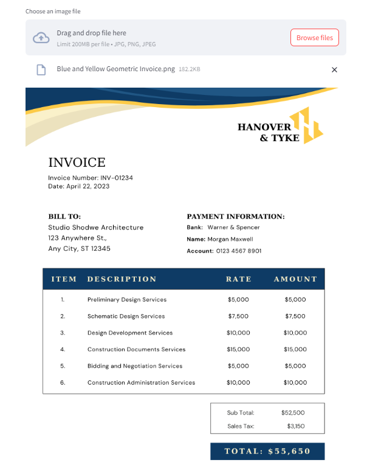

# Multilingual Invoice Extractor
This Streamlit application is designed to extract information from invoices in multiple languages using the Gemini model. It provides a user-friendly interface for uploading invoice images, which are then processed to extract and display relevant information.

## 1. Getting Started
Follow these instructions to get the application running on your local machine for development and testing purposes.

### 2. Prerequisites

1. Python 3.9 or later

2. pip

### 3. Installation
**Clone the repository:**

git clone https://github.com/AnisH1427/Invoice-Extractor.git

**Navigate to the project directory:**

cd Invoice-Extractor 

**Install the required Python packages:**

pip install -r requirements.txt 

## 4. Running the Application
Launch the application with the following command:
streamlit run app.py

After running the command, Streamlit will provide a local URL to access the web application.

## Features

1. **Image Upload and Display**: Users can upload invoice images, which are displayed using the Python Imaging Library (PIL).

2. **Multilingual Support**: Extracts invoice data in multiple languages, leveraging the capabilities of the Gemini model.

3. **Streamlit Frontend**: Offers an interactive and intuitive web interface built with Streamlit.

## How It Works
**Upload Invoice**: Users upload an invoice image through the Streamlit interface.

**Extraction**: The application processes the uploaded image, extracting text and relevant information using the Gemini model.

**Display Results**: Extracted data is displayed to the user, including detected text and any specific invoice details identified.

**Contributing**
We welcome contributions to improve the Multilingual Invoice Extractor. Feel free to fork the repository and submit pull requests.

**License**
This project is licensed under the MIT License - see the LICENSE file for details.

Please replace &lt;repository-url&gt; and &lt;project-directory&gt; with your actual repository URL and local project directory path. Adjust any specific details as necessary to fit your project's requirements and functionalities.
